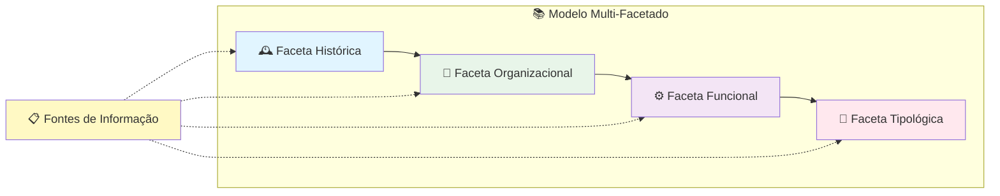
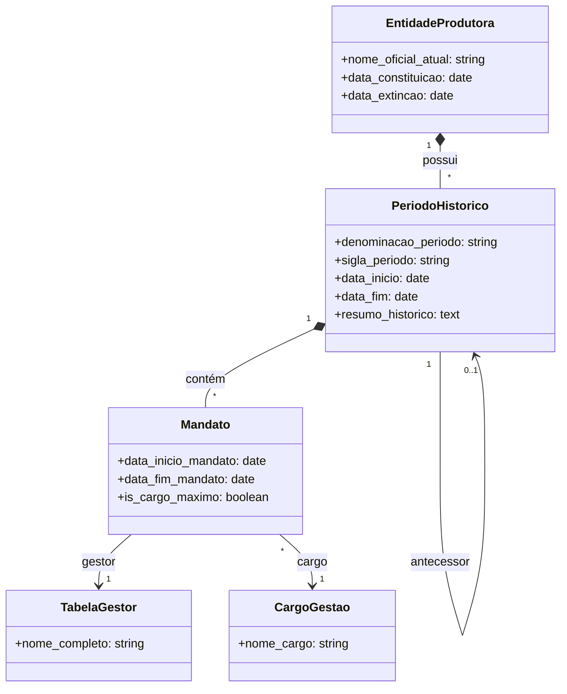
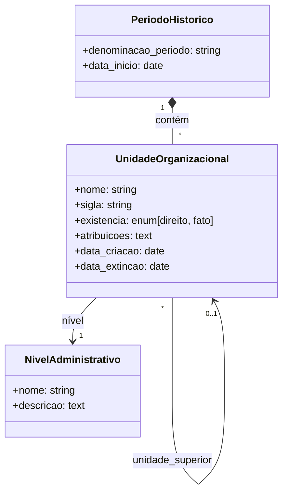
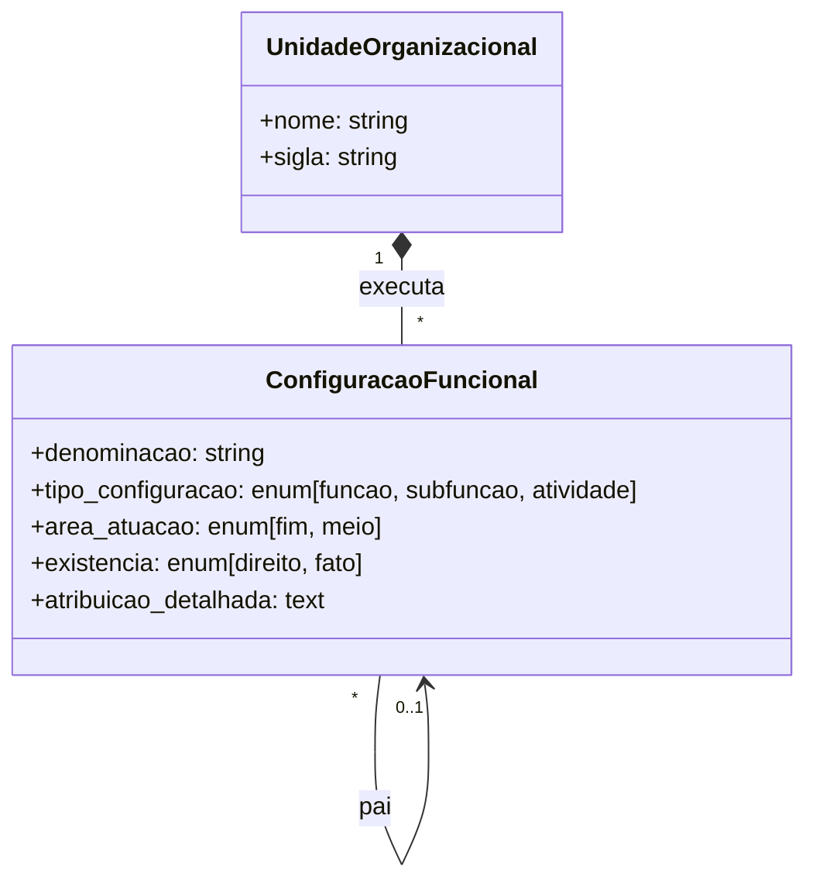
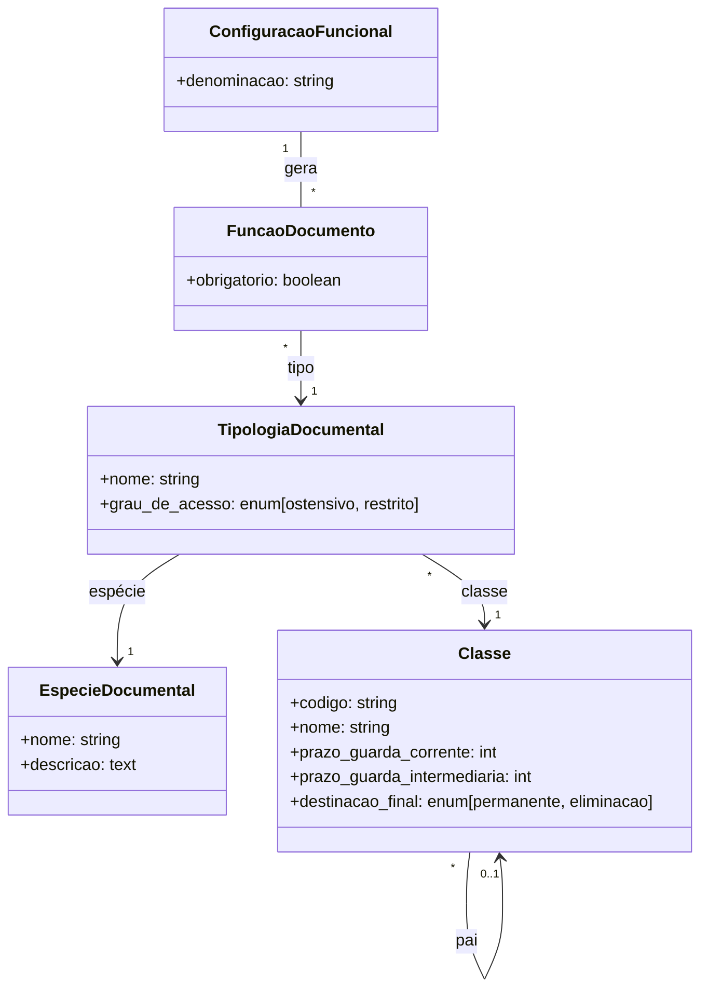
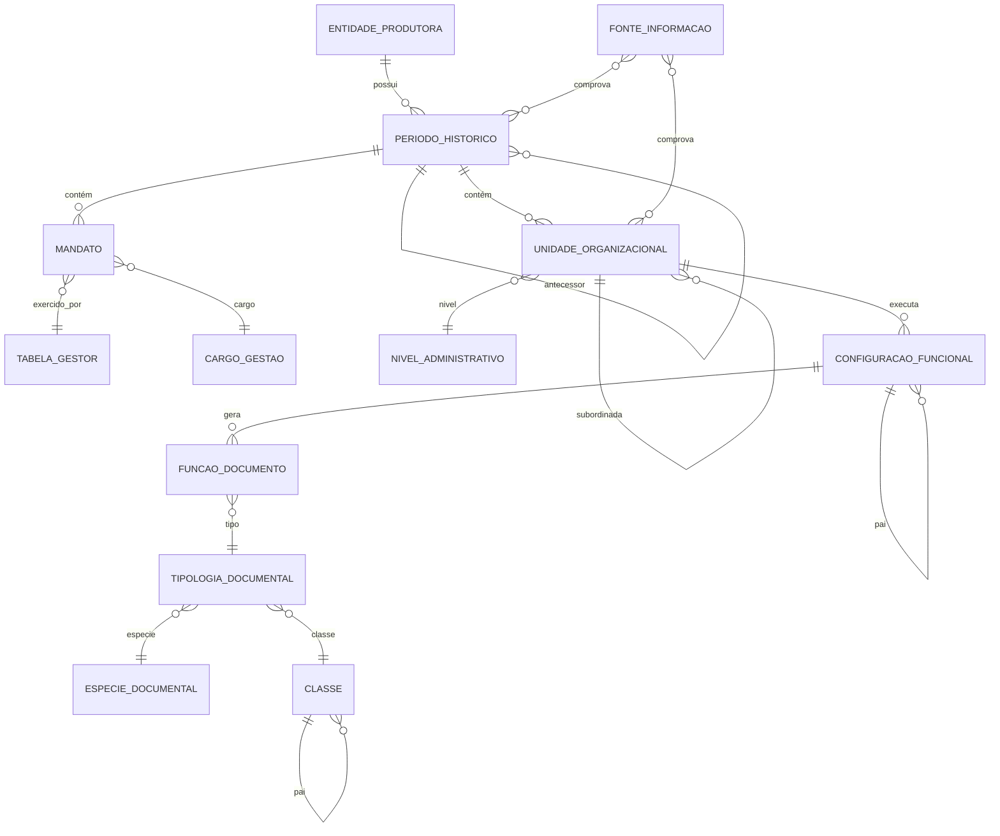

# Modelo Conceitual- Ontogenese - CAM
# 🧠 Modelo Conceitual - GestDoc

**Sistema de Gestão de Acervo Arquivístico**

---

## 📌 Visão Geral

O **GestDoc** é fundamentado em um modelo conceitual multi-facetado, inspirado nos princípios da Arquivologia e alinhado com normas brasileiras como o **e-ARQ Brasil** e a **NOBRADE**. A arquitetura de dados organiza a memória institucional através de **quatro facetas interconectadas**, permitindo rastrear a evolução histórica, organizacional, funcional e documental de uma instituição.



> [!IMPORTANT]
> **Princípio Central**: Toda informação registrada no sistema deve estar vinculada a uma **Fonte de Informação** (lei, decreto, portaria, resolução), garantindo rastreabilidade e respaldo documental.

---

## 🕰️ Faceta Histórica

Representa a **linha do tempo institucional**, documentando a evolução da entidade desde sua criação. Esta faceta é a raiz do modelo e contextualiza todas as demais informações.

### Entidades Principais

| Entidade | Descrição | Atributos Chave |
|----------|-----------|-----------------|
| **Entidade Produtora** | O conceito contínuo da instituição (ex: UFPB) | `nome_oficial_atual`, `data_constituicao`, `data_extincao` |
| **Período Histórico** | Uma "fase" ou "capítulo" da história institucional | `denominacao_periodo`, `sigla`, `data_inicio`, `data_fim`, `resumo_historico` |
| **Mandato** | Vincula gestor, cargo e período de atuação | `data_inicio_mandato`, `data_fim_mandato`, `is_cargo_maximo` |
| **Tabela Gestor** | Catálogo de pessoas que exerceram cargos de gestão | `nome_completo` |
| **Cargo Gestão** | Catálogo de cargos institucionais | `nome_cargo` |

### Diagrama de Classes



### Exemplo Prático

```
📂 UFPB (Entidade Produtora)
├── 📁 Universidade da Paraíba (1955-1960)
│   └── 🎖️ Reitor: João Pessoa (1955-1958)
│
├── 📁 UFPB - Desmembramento (1960-2002)
│   ├── 🎖️ Reitor: Fulano de Tal (1960-1964)
│   └── 🎖️ Reitor: Ciclano Silva (1964-1968)
│
└── 📁 UFPB - Atual (2002-presente)
    └── 🎖️ Reitora: Maria da Silva (2020-2024)
```

---

## 🏢 Faceta Organizacional

Representa o **organograma dinâmico** da instituição, onde cada unidade organizacional está vinculada a um período histórico específico. Isso permite visualizar como a estrutura organizacional evoluiu ao longo do tempo.

### Entidades Principais

| Entidade | Descrição | Atributos Chave |
|----------|-----------|-----------------|
| **Nível Administrativo** | Classificação hierárquica (Reitoria, Pró-Reitoria, Centro, etc.) | `nome`, `descricao` |
| **Unidade Organizacional** | Departamento, diretoria, coordenação, etc. | `nome`, `sigla`, `existencia`, `atribuicoes`, `data_criacao`, `data_extincao` |

### Características Especiais

- **Hierarquia Ilimitada**: Unidades podem ter subunidades em qualquer profundidade
- **Tipo de Existência**: 
  - *De Direito*: formalmente constituída por instrumento legal
  - *De Fato*: existência real sem formalização jurídica
- **Vínculo Temporal**: Toda unidade está atrelada a um período histórico

### Diagrama de Classes



### Exemplo Prático

```
📊 Organograma - UFPB (2002-presente)
├── 🏛️ [Reitoria] Gabinete do Reitor
│   ├── 📋 [Pró-Reitoria] PROGEP - Pró-Reitoria de Gestão de Pessoas
│   │   ├── 📁 [Coordenação] Coord. de Concursos
│   │   └── 📁 [Coordenação] Coord. de Capacitação
│   ├── 📋 [Pró-Reitoria] PROPLAN - Pró-Reitoria de Planejamento
│   └── 📋 [Pró-Reitoria] PRPG - Pró-Reitoria de Pós-Graduação
├── 🏫 [Centro] CCEN - Centro de Ciências Exatas e da Natureza
│   ├── 📚 [Departamento] Dept. de Matemática
│   └── 📚 [Departamento] Dept. de Física
└── 🏫 [Centro] CCJ - Centro de Ciências Jurídicas
```

---

## ⚙️ Faceta Funcional

Representa as **funções, sub-funções e atividades** desempenhadas pelas unidades organizacionais. Esta faceta mapeia "O QUE" a instituição faz, vinculando cada configuração funcional à unidade responsável.

### Entidades Principais

| Entidade | Descrição | Atributos Chave |
|----------|-----------|-----------------|
| **Configuração Funcional** | Função, Sub-função ou Atividade institucional | `denominacao`, `tipo_configuracao`, `area_atuacao`, `existencia`, `atribuicao_detalhada` |

### Classificações

**Tipo de Configuração:**
- `Função` → Conjunto de atribuições principais
- `Sub-função` → Divisão de uma função
- `Atividade` → Tarefa específica

**Área de Atuação:**
- `Atividade-Fim` → Relacionada à missão principal da instituição
- `Atividade-Meio` → Suporte administrativo

### Diagrama de Classes



### Exemplo Prático

```
📂 PROGEP - Pró-Reitoria de Gestão de Pessoas
├── ⚙️ [Função] Gestão de Recursos Humanos (Meio)
│   ├── 🔧 [Sub-função] Recrutamento e Seleção
│   │   ├── 📌 [Atividade] Realizar concursos públicos
│   │   └── 📌 [Atividade] Processar contratações
│   └── 🔧 [Sub-função] Capacitação e Desenvolvimento
│       ├── 📌 [Atividade] Elaborar plano de capacitação
│       └── 📌 [Atividade] Registrar participações em cursos
```

---

## 📄 Faceta Tipológica

Representa os **tipos de documentos** produzidos pela instituição, vinculando cada tipologia às espécies documentais, ao plano de classificação e às funções que os geram.

### Entidades Principais

| Entidade | Descrição | Atributos Chave |
|----------|-----------|-----------------|
| **Espécie Documental** | Categoria genérica de documento (Ata, Ofício, Relatório) | `nome`, `descricao` |
| **Classe** | Código do plano de classificação com temporalidade | `codigo`, `nome`, `prazo_guarda_corrente`, `prazo_guarda_intermediaria`, `destinacao_final` |
| **Tipologia Documental** | Tipo específico de documento (ex: "Ata de Reunião de Colegiado") | `nome`, `especie`, `classe`, `grau_de_acesso` |
| **Função Documento** | Ligação entre função geradora e documento | `configuracao_funcional`, `tipologia_documental`, `obrigatorio` |

### Diagrama de Classes



### Tabela de Temporalidade (Exemplo)

| Código | Classe | Corrente | Intermediário | Destinação |
|--------|--------|----------|---------------|------------|
| 020.1 | Normas e Regulamentos | 5 anos | 10 anos | 🏛️ Permanente |
| 023 | Documentos de Reunião | 2 anos | 5 anos | 🏛️ Permanente |
| 062.6 | Férias | 1 ano | 5 anos | 🗑️ Eliminação |

### Exemplo Prático

```
📄 Tipologia: "Ata de Reunião de Colegiado"
├── 📋 Espécie: Ata
├── 🏷️ Classe: 023 - Documentos de Reunião
│   ├── Corrente: 2 anos
│   ├── Intermediário: 5 anos
│   └── Destinação: Permanente
├── 🔒 Acesso: Ostensivo
└── ⚙️ Funções Geradoras:
    ├── Deliberar sobre matérias acadêmicas (Obrigatório ✅)
    └── Aprovar normas internas
```

---

## 📋 Fontes de Informação

Elemento transversal que garante a **rastreabilidade** de todas as informações do sistema. Cada registro pode ser vinculado a uma ou mais fontes que comprovam sua veracidade.

### Tipos de Fonte

| Tipo | Descrição |
|------|-----------|
| **Lei** | Legislação federal, estadual ou municipal |
| **Decreto** | Atos normativos do poder executivo |
| **Portaria** | Atos administrativos internos |
| **Resolução** | Decisões de órgãos colegiados |
| **Ata** | Registro de reuniões |
| **Relatório** | Documentos técnicos ou de gestão |
| **Outro** | Demais tipos de fonte |

### Atributos

- `titulo`: Denominação oficial da fonte
- `tipo_fonte`: Classificação do tipo de documento
- `data_documento`: Data de publicação/criação
- `resumo`: Descrição do conteúdo
- `arquivo_pdf`: Upload do documento digitalizado
- `link_externo`: URL para acesso online

---

## 🔗 Diagrama Completo de Relacionamentos



---

## 🎯 Casos de Uso do Modelo

### 1. Reconstrução de Memória Institucional
> "Qual era a estrutura organizacional da UFPB em 1985?"

O modelo permite navegar até o período histórico correspondente e visualizar o organograma daquela época, incluindo gestores e unidades vigentes.

### 2. Rastreabilidade Documental
> "Qual portaria criou o Departamento de Computação?"

Através das Fontes de Informação vinculadas às unidades, é possível identificar o documento legal de criação.

### 3. Gestão de Prazos de Temporalidade
> "Quais documentos da PROGEP podem ser eliminados?"

A Faceta Tipológica permite filtrar documentos pelos prazos de guarda e destinação final.

### 4. Mapeamento de Competências
> "Quem é responsável pela função de 'Realizar Concursos Públicos'?"

A Faceta Funcional vincula cada atividade à unidade organizacional responsável.

---

## 📚 Normas e Referências

O modelo conceitual do GestDoc está alinhado com:

| Norma | Descrição |
|-------|-----------|
| **e-ARQ Brasil** | Modelo de Requisitos para Sistemas Informatizados de Gestão Arquivística |
| **NOBRADE** | Norma Brasileira de Descrição Arquivística |
| **ISAD(G)** | International Standard Archival Description |
| **CONARQ** | Conselho Nacional de Arquivos |

---

<div align="center">

**Modelo projetado para preservar e tornar acessível a memória institucional brasileira**

[📖 Voltar ao README Principal](README.md) | [🚀 Guia de Povoamento](GUIA_POVOAMENTO.md)

</div>
